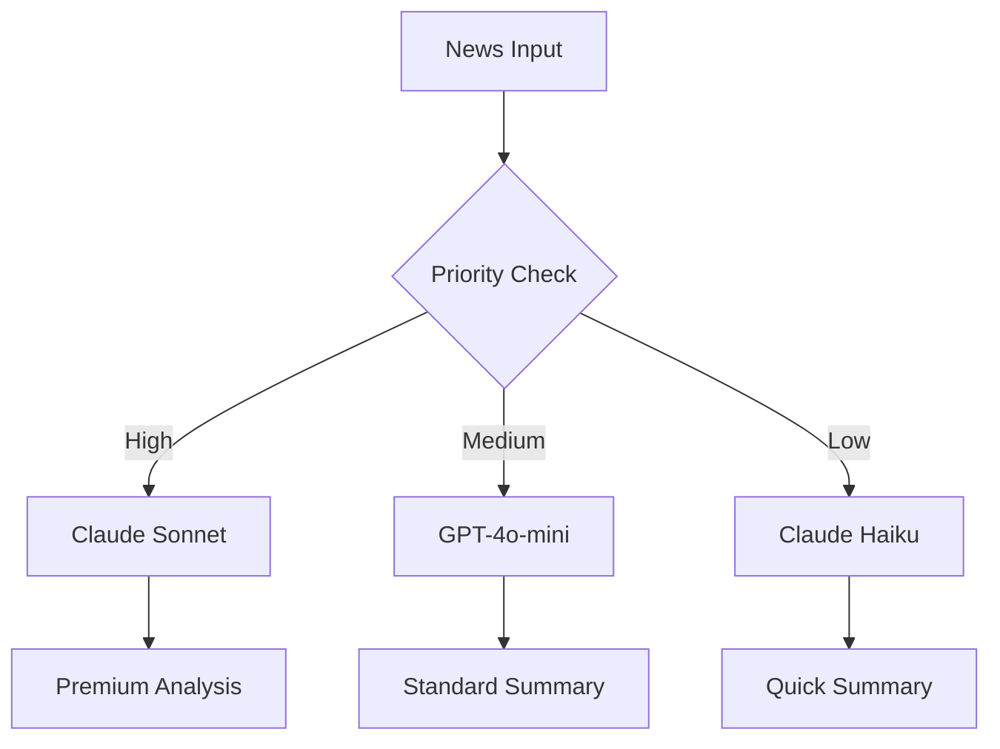
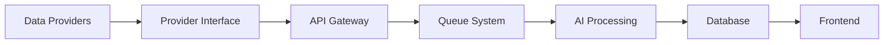

# 📊 StockIQ - AI Orchestra Powered Investment Platform

> AI Orchestra 방식으로 6개 AI가 협업하여 만드는 차세대 투자 플랫폼


## 🚀 AI Orchestra 방식

StockIQ는 ai-orchestra-v02 방식을 적용하여 6개 AI가 협업하는 투자 플랫폼입니다.

### 작업 프로세스
1. **PM Claude**가 이슈 분석 및 생성
2. **[AI] 태그**로 GitHub Actions 자동 트리거
3. **6개 AI**가 각자 전문 영역에서 작업
4. **자동 통합** 및 배포

### ✨ Key Features

- 📈 **실시간 시세 조회** - 국내 주식 실시간 시세 및 차트
- 📰 **AI 뉴스 요약** - Claude AI를 활용한 스마트 뉴스 분석
- 📊 **기술적 분석** - TradingView 차트 및 다양한 기술 지표
- 📝 **스마트 노트** - AI 기반 투자 노트 및 인사이트 생성
- 🔔 **실시간 알림** - 가격 도달 및 중요 뉴스 알림
- 📤 **내보내기** - PDF, Excel, Notion 연동 지원

## 🛠️ Tech Stack

### Frontend
- **Framework**: Next.js 14 (App Router)
- **Language**: TypeScript 5.x
- **Styling**: Tailwind CSS + shadcn/ui
- **State**: Zustand
- **Charts**: TradingView Widget + Recharts

### Backend
- **API**: Next.js API Routes
- **Database**: Supabase (PostgreSQL)
- **Auth**: Supabase Auth
- **Queue**: Bull (Redis)
- **AI**: Claude API (Anthropic)

### Data Providers
- 한국투자증권 OpenAPI
- Yahoo Finance
- Alpha Vantage
- 네이버 뉴스 API

## 📦 Installation

### Prerequisites
- Node.js 20.x or higher
- pnpm (recommended) or npm
- Supabase account
- API keys (see Environment Variables)

### Setup

1. **Clone the repository**
```bash
git clone https://github.com/yourusername/stockiq.git
cd stockiq
```

2. **Install dependencies**
```bash
pnpm install
# or
npm install
```

3. **Set up environment variables**
```bash
cp .env.example .env.local
```

Edit `.env.local` with your API keys:
```env
# Supabase
NEXT_PUBLIC_SUPABASE_URL=your_supabase_url
NEXT_PUBLIC_SUPABASE_ANON_KEY=your_anon_key

# AI
CLAUDE_API_KEY=your_claude_api_key

# Stock APIs
KIS_API_KEY=your_korea_investment_key
KIS_API_SECRET=your_korea_investment_secret
ALPHA_VANTAGE_KEY=your_alpha_vantage_key

# News APIs
NAVER_CLIENT_ID=your_naver_client_id
NAVER_CLIENT_SECRET=your_naver_client_secret
NEWS_API_KEY=your_newsapi_key

# Optional
NOTION_API_KEY=your_notion_key
REDIS_URL=your_redis_url
```

4. **Set up database**
```bash
pnpm db:push
pnpm db:seed
```

5. **Run development server**
```bash
pnpm dev
```

Open [http://localhost:3000](http://localhost:3000) to see the app.

## 🏗️ Project Structure

```
stockiq/
├── app/                    # Next.js App Router
├── components/             # React components
├── lib/                    # Business logic
│   ├── providers/         # Data providers
│   ├── ai/               # AI services
│   ├── queues/           # Job queues
│   └── db/               # Database
├── hooks/                 # Custom React hooks
├── stores/                # Zustand stores
├── types/                 # TypeScript types
└── config/                # Configuration
```

## 🚦 Development Roadmap

### Phase 1: Foundation (Week 1-2) ✅
- [x] Project setup
- [x] Authentication system
- [x] Database design
- [ ] Basic UI components

### Phase 2: Core Features (Week 3-4) 🚧
- [ ] Stock API integration
- [ ] News collection system
- [ ] AI summarization
- [ ] Dashboard development

### Phase 3: Intelligence (Week 5-6) 📋
- [ ] RAG system
- [ ] Smart notes
- [ ] Technical charts
- [ ] Theme clustering

### Phase 4: Polish (Week 7-8) 📋
- [ ] Alert system
- [ ] Export features
- [ ] Mobile optimization
- [ ] Performance tuning

## 📊 Architecture

### AI Strategy


### Data Flow


## 🧪 Testing

```bash
# Run unit tests
pnpm test

# Run e2e tests
pnpm test:e2e

# Run type checking
pnpm type-check

# Run linting
pnpm lint
```

## 📈 Performance Metrics

### Target KPIs
- API Response Time: < 500ms
- News Summary Generation: < 3s
- Page Load Time: < 2s
- Error Rate: < 1%
- Uptime: > 99.5%

## 🤝 Contributing

We welcome contributions! Please see our [Contributing Guide](CONTRIBUTING.md) for details.

### Development Workflow
1. Fork the repository
2. Create your feature branch (`git checkout -b feature/AmazingFeature`)
3. Commit your changes (`git commit -m 'Add some AmazingFeature'`)
4. Push to the branch (`git push origin feature/AmazingFeature`)
5. Open a Pull Request

### Commit Convention
- `feat:` New feature
- `fix:` Bug fix
- `docs:` Documentation
- `style:` Code style
- `refactor:` Code refactoring
- `test:` Testing
- `chore:` Maintenance

## 📝 Documentation

- [API Documentation](docs/API.md)
- [Architecture Guide](docs/ARCHITECTURE.md)
- [Development Guide](docs/DEVELOPMENT.md)
- [Deployment Guide](docs/DEPLOYMENT.md)

## 🔒 Security

- All API communications use HTTPS
- User data is encrypted (AES-256)
- JWT + Refresh Token authentication
- Rate limiting on all endpoints
- Regular security audits

## 📄 License

This project is licensed under the MIT License - see the [LICENSE](LICENSE) file for details.

## 👥 Team

- **Thomas** - Project Lead & Developer

## 🙏 Acknowledgments

- [한국투자증권](https://www.truefriend.com/) for stock market data
- [Anthropic](https://www.anthropic.com/) for Claude AI
- [Supabase](https://supabase.com/) for backend infrastructure
- [Vercel](https://vercel.com/) for hosting

## 📞 Support

- Email: support@stockiq.app
- Issues: [GitHub Issues](https://github.com/yourusername/stockiq/issues)
- Discord: [Join our community](https://discord.gg/stockiq)

---

<p align="center">
  Made with ❤️ by Thomas
  <br/>
  © 2025 StockIQ. All rights reserved.
</p>