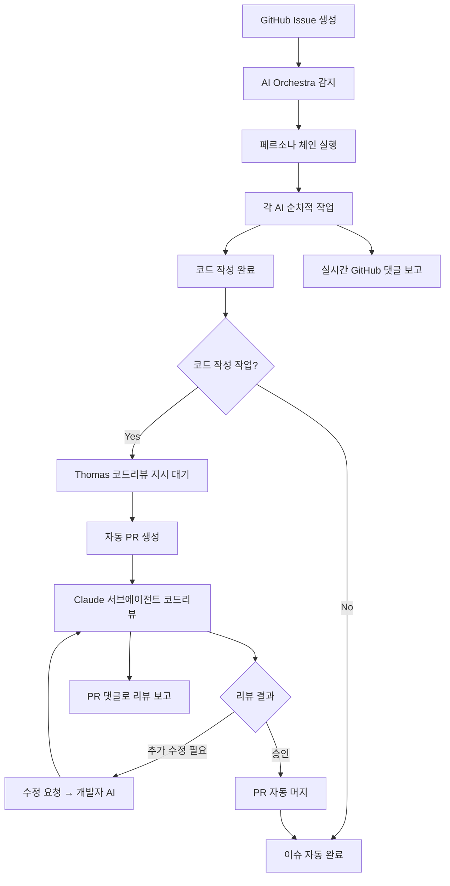

# 🎭 AI Orchestra 완전 자동화 워크플로우 v2.0

## 📋 확장된 자동화 프로세스

### 🔄 전체 워크플로우 (코드리뷰 포함)



## 🤖 AI 에이전트별 자동 보고 시스템

### 1. 작업 완료 시 자동 댓글 생성
각 AI가 작업을 완료하면 다음 템플릿으로 자동 댓글 생성:

```python
# ai_orchestra/auto_reporter.py
def report_completion(persona_name, issue_number, work_results):
    comment_template = f"""
## {get_persona_emoji(persona_name)} {persona_name} 작업 완료

### ✅ 완료된 작업
{format_completed_tasks(work_results)}

### 📁 생성/수정된 파일
{format_files(work_results.get('files', []))}

### 🧪 테스트 결과
{format_test_results(work_results.get('tests', {}))}

### 🔄 다음 단계
{get_next_persona(persona_name)}에게 작업 전달

### 📊 작업 메트릭
- 소요 시간: {work_results.get('duration', '0')}분
- 생성 파일: {len(work_results.get('files', []))}개
- 테스트 통과: {work_results.get('tests_passed', 0)}/{work_results.get('total_tests', 0)}

---
*AI Orchestra - {persona_name} 자동 실행*
*완료 시간: {datetime.now().isoformat()}*
"""
    
    # GitHub API로 자동 댓글 생성
    post_github_comment(issue_number, comment_template)
```

### 2. 코드 작성 완료 시 특별 처리

```python
def handle_code_completion(persona_name, issue_number, code_results):
    # 일반 완료 보고
    report_completion(persona_name, issue_number, code_results)
    
    # 코드리뷰 대기 상태 추가
    review_waiting_comment = f"""
## 🔍 코드리뷰 대기중

### 📝 생성된 코드
{format_code_summary(code_results)}

### ⏳ 다음 단계
**Thomas의 코드리뷰 지시를 기다리고 있습니다.**

코드리뷰를 시작하려면 다음 명령어를 댓글로 입력하세요:
```
@ai-orchestra code-review
```

또는 이슈에 `code-review` 라벨을 추가하세요.

---
*코드리뷰 자동화 대기중...*
"""
    
    post_github_comment(issue_number, review_waiting_comment)
    
    # 이슈에 code-review-pending 라벨 추가
    add_github_label(issue_number, "code-review-pending")
```

## 🔍 자동 코드리뷰 프로세스

### 1. 코드리뷰 트리거 감지

```python
# ai_orchestra/code_review_trigger.py
class CodeReviewTrigger:
    def __init__(self):
        self.triggers = [
            "@ai-orchestra code-review",
            "라벨: code-review",
            "/review",
            "코드리뷰 시작"
        ]
    
    def detect_review_request(self, issue_number, comment_text=None, labels=None):
        """코드리뷰 요청 감지"""
        if comment_text:
            for trigger in self.triggers:
                if trigger in comment_text.lower():
                    return True
        
        if labels and "code-review" in labels:
            return True
            
        return False
    
    def start_code_review_process(self, issue_number):
        """자동 코드리뷰 프로세스 시작"""
        # 1. PR 자동 생성
        pr_number = self.create_automatic_pr(issue_number)
        
    # 2. Claude 서브에이전트로 코드리뷰 실행
    review_result = self.execute_claude_code_review(pr_number)
    
    # 3. 결과에 따른 자동 처리
    self.handle_review_result(pr_number, issue_number, review_result)        return pr_number
```

### 2. 자동 PR 생성

```python
def create_automatic_pr(self, issue_number):
    """이슈 기반 자동 PR 생성"""
    
    # 이슈 정보 가져오기
    issue_info = get_github_issue(issue_number)
    branch_name = f"feature/issue-{issue_number}"
    
    # 현재 변경사항을 새 브랜치로 커밋
    subprocess.run([
        "git", "checkout", "-b", branch_name
    ])
    
    subprocess.run([
        "git", "add", "."
    ])
    
    subprocess.run([
        "git", "commit", "-m", f"feat: {issue_info['title']}\n\nCloses #{issue_number}"
    ])
    
    subprocess.run([
        "git", "push", "origin", branch_name
    ])
    
    # PR 생성
    pr_body = f"""
## 📋 연관 이슈
Closes #{issue_number}

## 🎯 작업 내용
{issue_info['body'][:500]}...

## 🤖 AI Orchestra 자동 생성
이 PR은 AI Orchestra에 의해 자동으로 생성되었습니다.

### 🔍 코드리뷰 대기중
Code Review AI가 자동으로 리뷰를 진행합니다.

---
*AI Orchestra v2.0 - 자동 PR 생성*
"""
    
    result = subprocess.run([
        "gh", "pr", "create",
        "--title", f"[AI] {issue_info['title']}",
        "--body", pr_body,
        "--label", "ai-generated",
        "--label", "needs-review"
    ], capture_output=True, text=True)
    
    if result.returncode == 0:
        pr_url = result.stdout.strip()
        pr_number = pr_url.split('/')[-1]
        return pr_number
    
    return None
```

### 3. Claude 코드리뷰 실행

```python
def execute_code_review_ai(self, pr_number):
    """Claude 페르소나로 코드리뷰 실행"""
    
    # 기존 Claude 페르소나 로드 (이미 코드리뷰 전문가)
    claude_persona = load_persona("Claude.json")
    
    # PR의 변경사항 분석
    diff_content = get_pr_diff(pr_number)
    
    # Claude 서브에이전트로 코드리뷰 실행
    review_result = execute_ai_persona(
        persona=claude_persona,
        task="code_review",
        subagent_mode=True,  # 서브에이전트 모드
        context={
            "pr_number": pr_number,
            "diff_content": diff_content,
            "review_criteria": [
                "코드 품질 및 통합성",
                "보안 취약점",
                "성능 최적화",
                "테스트 커버리지",
                "TypeScript 타입 안전성",
                "StockIQ 아키텍처 일관성"
            ]
        }
    )
    
    # 리뷰 결과를 PR 댓글로 자동 게시
    post_pr_review_comment(pr_number, review_result)
    
    return review_result
```

### 4. 코드리뷰 결과 자동 처리

```python
def handle_review_result(self, pr_number, issue_number, review_result):
    """Claude 코드리뷰 결과에 따른 자동 처리"""
    
    if review_result['approval'] == 'APPROVED':
        # 승인 시 자동 머지
        self.auto_merge_pr(pr_number, issue_number)
        
    elif review_result['approval'] == 'REQUEST_CHANGES':
        # 수정 요청 시 해당 개발자 AI에게 수정 지시
        self.request_code_changes(pr_number, issue_number, review_result['changes'])
        
    elif review_result['approval'] == 'COMMENT':
        # 일반 코멘트 - Thomas 판단 대기
        self.wait_for_human_decision(pr_number, issue_number, review_result)

def auto_merge_pr(self, pr_number, issue_number):
    """PR 자동 머지 및 이슈 완료"""
    
    # PR 머지
    subprocess.run([
        "gh", "pr", "merge", pr_number,
        "--squash",
        "--delete-branch"
    ])
    
    # 이슈 자동 완료
    close_github_issue(issue_number, "✅ AI Orchestra 자동 완료 - 코드리뷰 통과 및 PR 머지됨")
    
    # 완료 보고 댓글
    completion_comment = f"""
## 🎉 작업 완료!

### ✅ 완료된 프로세스
1. ✅ AI 페르소나 체인 작업 완료
2. ✅ 코드리뷰 AI 승인
3. ✅ PR #{pr_number} 자동 머지
4. ✅ 이슈 자동 완료

### 📊 최종 결과
- 총 소요시간: {calculate_total_time(issue_number)}
- 참여 AI: {count_participating_ais(issue_number)}명
- 생성 파일: {count_generated_files(issue_number)}개
- 코드리뷰 점수: {review_result.get('score', 'N/A')}/100

### 🔄 다음 단계
다음 Round 이슈가 자동으로 시작됩니다.

---
*🎭 AI Orchestra v2.0 - 완전 자동화 완료*
*완료 시간: {datetime.now().isoformat()}*
"""
    
    post_github_comment(issue_number, completion_comment)
```

## 🤖 기존 Claude 페르소나 활용

Claude는 이미 "통합 및 코드 리뷰" 전문가로 설정되어 있어 별도의 Code Review AI 없이 서브에이전트 모드로 활용:

```json
// ai_orchestra/personas/Claude.json (기존)
{
  "name": "Claude",
  "role": "Senior Developer", 
  "specialty": "통합 및 코드 리뷰",
  "stockiq_tasks": [
    "코드 통합",
    "품질 검증", 
    "버그 수정",
    "최적화"
  ],
  "output_path": "/src/",
  "command": "claude -p"
}
```

### Claude 코드리뷰 서브에이전트 실행
```python
def execute_claude_subagent_review(pr_number, issue_context):
    """Claude 서브에이전트로 코드리뷰 실행"""
    
    review_prompt = f"""
🔍 StockIQ 코드리뷰 수행

**PR #{pr_number} 검토 요청**

당신은 StockIQ의 Senior Developer이자 코드리뷰 전문가입니다.
다음 기준으로 코드를 검토해주세요:

1. **코드 품질 및 통합성** - StockIQ 아키텍처와의 일관성
2. **보안 및 성능** - 취약점 및 최적화 가능성  
3. **타입 안전성** - TypeScript 타입 정의 완전성
4. **테스트 커버리지** - 단위/통합 테스트 충분성
5. **문서화** - 코드 주석 및 README 업데이트

**검토 결과를 다음 형식으로 제공:**
- APPROVED / REQUEST_CHANGES / COMMENT
- 구체적인 개선 사항 (있을 경우)
- 추천 점수 (1-100)
"""
    
    # Claude 서브에이전트 실행
    result = execute_subagent(
        agent="claude",
        task="code_review", 
        prompt=review_prompt,
        context={"pr_number": pr_number, "issue_context": issue_context}
    )
    
    return result
```

## 🔔 실시간 알림 시스템

```python
# ai_orchestra/notification_system.py
class NotificationSystem:
    def __init__(self):
        self.channels = {
            "github": GitHubNotifier(),
            "slack": SlackNotifier(),  # 선택사항
            "email": EmailNotifier()   # 선택사항
        }
    
    def notify_workflow_start(self, issue_number, workflow_name):
        """워크플로우 시작 알림"""
        message = f"🎭 AI Orchestra 시작: {workflow_name} (Issue #{issue_number})"
        self.send_notification("workflow_start", message)
    
    def notify_persona_completion(self, persona_name, issue_number):
        """페르소나 작업 완료 알림"""
        message = f"✅ {persona_name} 작업 완료 (Issue #{issue_number})"
        self.send_notification("persona_completion", message)
    
    def notify_code_review_ready(self, pr_number, issue_number):
        """코드리뷰 준비 완료 알림"""
        message = f"🔍 코드리뷰 준비 완료: PR #{pr_number} (Issue #{issue_number})"
        self.send_notification("code_review_ready", message)
    
    def notify_workflow_completion(self, issue_number, result):
        """전체 워크플로우 완료 알림"""
        message = f"🎉 AI Orchestra 완료: Issue #{issue_number} - {result['status']}"
        self.send_notification("workflow_completion", message)
```

## 🎯 사용법 요약

### Thomas가 해야 할 일:
1. **이슈 생성** - GitHub에서 Round 이슈 생성
2. **코드리뷰 지시** - 코드 작성 완료 시 `@ai-orchestra code-review` 댓글
3. **결과 확인** - 모든 과정이 자동으로 진행되며 실시간 알림 받기

### AI Orchestra가 자동으로 하는 일:
1. **페르소나 체인 실행** - 순차적 AI 작업
2. **실시간 보고** - 각 단계별 GitHub 댓글
3. **PR 자동 생성** - 코드리뷰 요청 시
4. **코드리뷰 실행** - Code Review AI 자동 실행
5. **PR 머지/이슈 완료** - 승인 시 자동 처리

### 모든 과정의 기록:
- ✅ GitHub Issue 댓글에 실시간 기록
- ✅ PR 댓글에 코드리뷰 상세 기록  
- ✅ 세션이 끊어져도 GitHub에 모든 히스토리 보존

이제 Thomas는 단순히 이슈 생성과 코드리뷰 지시만 하면, AI들이 알아서 협업하여 완성된 결과물을 만들고 자동으로 PR까지 머지해줍니다! 🎉

---

*AI Orchestra v2.0 - 완전 자동화 워크플로우*
*작성: PM Claude | 2025.09.01*
*상태: 영구 기억 - 세션 독립적*
