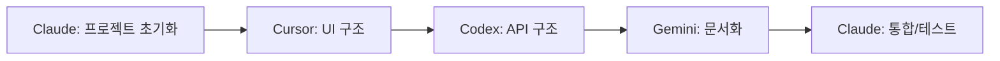
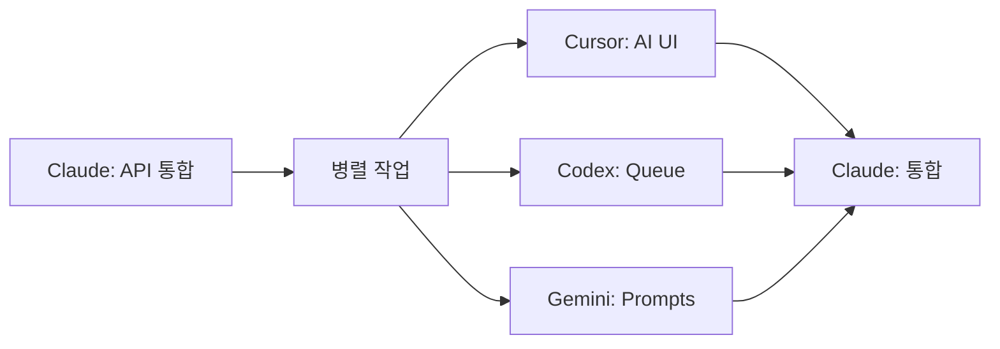

# 🤖 StockIQ AI Orchestra 협업 가이드

## 📋 개요
StockIQ 프로젝트는 여러 AI가 협업하여 개발하는 AI Orchestra 방식을 채택합니다.

## 🎭 AI 팀 구성

### 3. Claude (PM/Backend Lead)
- **역할**: 프로젝트 관리, 백엔드 개발, 팀 조율, **코드리뷰**
- **병렬 작업**: 설정 파일, API 구조, 데이터베이스 스키마
- **책임**: 
  - 이슈 분석 및 작업 분할
  - package.json, 환경설정 파일
  - 팀 간 충돌 방지 및 통합
  - **최종 코드리뷰 및 품질 검증**

### 2. Cursor (Frontend Lead)
- **역할**: 프론트엔드 개발, UI/UX 구현
- **병렬 작업**: React 컴포넌트, 페이지, 스타일링
- **책임**:
  - app/ 폴더 구조 및 기본 페이지
  - 컴포넌트 라이브러리 설정
  - 반응형 디자인 및 UI 구현
  - 상태 관리 (Zustand)

### 3. Codex (Infrastructure Lead)
- **역할**: 백엔드 인프라, API, 시스템 아키텍처
- **병렬 작업**: API routes, middleware, 서버 설정
- **책임**:
  - API 엔드포인트 구현
  - 미들웨어 및 보안 설정
  - 퍼포먼스 최적화
  - 인프라 및 배포 설정

### 4. Gemini (Documentation/QA Lead)
- **역할**: 문서화, 테스트, 품질 관리
- **병렬 작업**: README, 가이드, 테스트 케이스
- **책임**:
  - 프로젝트 문서화
  - 개발자 가이드 작성
  - 테스트 시나리오 및 QA
  - 사용자 매뉴얼

## 📐 협업 프로세스 (v2.0 - 진짜 병렬 협업)

### 1단계: 이슈 분석 및 작업 분할 (Claude PM)
```bash
# Claude PM이 이슈를 분석하고 작업을 병렬로 분할
gh issue view [ISSUE_NUMBER] -R ihw33/StockIQ

# 예시: Issue #28 "Next.js 프로젝트 초기 설정"
# → 4개 병렬 작업으로 분할
```

### 2단계: 동시 병렬 작업 시작 (4개 AI 동시 실행)
```yaml
# 모든 AI가 동시에 작업 시작
Claude (Backend Lead):
  담당: package.json, tsconfig.json, next.config.js 설정
  파일: /package.json, /tsconfig.json, /next.config.js
  시간: 15분

Cursor (Frontend Lead):
  담당: app/ 폴더 구조, 기본 페이지, 레이아웃
  파일: /app/layout.tsx, /app/page.tsx, /app/globals.css
  시간: 20분

Codex (Infrastructure):
  담당: API routes, middleware, 환경설정
  파일: /app/api/, /middleware.ts, /.env.example
  시간: 15분

Gemini (Documentation):
  담당: README, 문서화, 개발 가이드
  파일: /README.md, /docs/setup.md, /docs/dev-guide.md
  시간: 10분
```

### 3단계: 실시간 협업 및 통합
```bash
# 모든 AI가 동시에 작업하면서 실시간 조율
# 충돌 방지를 위한 파일 분할
# 완료되는 대로 GitHub 이슈에 보고
```

### 4단계: 자동 통합 및 테스트
```bash
# 모든 AI 작업 완료 후 Claude PM이 통합
git pull origin main
pnpm install
pnpm build
pnpm test
```

### 5단계: PR 및 머지 (자동화)
```bash
# 코드 작업 완료 시 자동 대기 상태
# Thomas의 코드리뷰 지시: @ai-orchestra code-review

# 자동 PR 생성
git checkout -b feature/issue-[NUMBER]
gh pr create --title "[Issue #N] 기능 구현" --body "..."

# Claude 서브에이전트 코드리뷰 실행
claude --subagent code-review --pr [PR_NUMBER]

# 승인 시 자동 머지
gh pr merge --squash
```

### 6단계: 이슈 자동 완료
```bash
# 이슈 상태 자동 업데이트
gh issue close [ISSUE_NUMBER] --comment "✅ AI Orchestra 자동 완료"
```

## 📝 이슈 템플릿

```markdown
# 🎯 [기능명]

## 📋 작업 개요
[작업 설명]

## 🤖 AI 팀 역할 분담

### Claude (PM/Backend)
- [작업 1]
- [작업 2]

### Cursor (Frontend/UX)
```
지시사항:
1. [구체적 작업 1]
2. [구체적 작업 2]
```

### Codex (Backend/Infrastructure)
```
지시사항:
1. [구체적 작업 1]
2. [구체적 작업 2]
```

### Gemini (Content/Documentation)
```
지시사항:
1. [구체적 작업 1]
2. [구체적 작업 2]
```

## ✅ 체크리스트
- [ ] Phase 1: [Claude 작업]
- [ ] Phase 2: [Cursor 작업]
- [ ] Phase 3: [Codex 작업]
- [ ] Phase 4: [Gemini 작업]
- [ ] **코드리뷰**: Thomas 지시 → 자동 PR → Claude 리뷰 → 자동 머지

## 🎯 완료 기준
- [ ] [기준 1]
- [ ] [기준 2]
- [ ] **코드리뷰 통과 및 PR 자동 머지**
```

## 🔄 워크플로우 예시

### Issue #1: Next.js 프로젝트 설정


### Issue #14: AI 통합


## 💡 협업 팁

### 1. 명확한 인터페이스 정의
```typescript
// types/index.d.ts에 공통 타입 정의
interface NewsItem {
  id: string;
  title: string;
  summary?: string;
  sentiment?: number;
}
```

### 2. Git 브랜치 전략
```bash
main
├── feature/issue-1-claude
├── feature/issue-1-cursor
├── feature/issue-1-codex
└── feature/issue-1-gemini
```

### 3. 커뮤니케이션
- 각 AI는 작업 완료 시 코멘트 남기기
- 블로커 발생 시 즉시 보고
- 일일 진행 상황 업데이트

## 📊 성과 측정

### 개발 속도
- 이슈당 평균 완료 시간
- AI별 작업 효율성
- 병렬 처리 효과

### 품질 지표
- 버그 발생률
- 코드 리뷰 통과율
- 테스트 커버리지

## 🚀 시작하기

### 1. 이슈 선택
```bash
gh issue list -R ihw33/StockIQ --label "P0-Critical"
```

### 2. 작업 시작
```bash
gh issue edit [NUMBER] --add-assignee @me
```

### 3. 브랜치 생성
```bash
git checkout -b feature/issue-[NUMBER]-[AI-NAME]
```

### 4. 작업 수행
각 AI의 지시사항에 따라 작업 수행

### 5. PR 생성
```bash
gh pr create --fill
```

---

## 🎯 **Thomas의 코드리뷰 자동화 사용법 요약**

### 1. **이슈 생성** 
```bash
gh issue create --title "[기능명]" --body "..."
```

### 2. **AI들이 자동으로 작업 수행**
- Claude, Cursor, Codex, Gemini 순차 협업
- 실시간 진행상황 GitHub 댓글로 보고

### 3. **코드 작성 완료 시 대기 상태**
- AI가 "🔍 코드리뷰 대기중" 댓글 생성
- Thomas 지시 대기

### 4. **코드리뷰 지시**
```bash
# 이슈 댓글에 입력
@ai-orchestra code-review
```

### 5. **완전 자동화 실행**
- 자동 PR 생성
- Claude 서브에이전트 코드리뷰  
- 승인 시 PR 자동 머지
- 이슈 자동 완료

### 💡 **핵심**: 이슈 생성 + 코드리뷰 지시만 하면 끝! 🚀

---

## 📅 일일 스탠드업 템플릿

```markdown
## 🌅 Daily Standup - [날짜]

### Claude
- ✅ 완료: [작업]
- 🔄 진행중: [작업]
- 📋 계획: [작업]
- 🚧 블로커: [이슈]

### Cursor
- ✅ 완료: [작업]
- 🔄 진행중: [작업]
- 📋 계획: [작업]

### Codex
- ✅ 완료: [작업]
- 🔄 진행중: [작업]
- 📋 계획: [작업]

### Gemini
- ✅ 완료: [작업]
- 🔄 진행중: [작업]
- 📋 계획: [작업]

### 오늘의 목표
- [ ] Issue #[N] 완료
- [ ] PR 머지
```

---

*StockIQ AI Orchestra Guide v1.0*
*최종 업데이트: 2025.01.30*