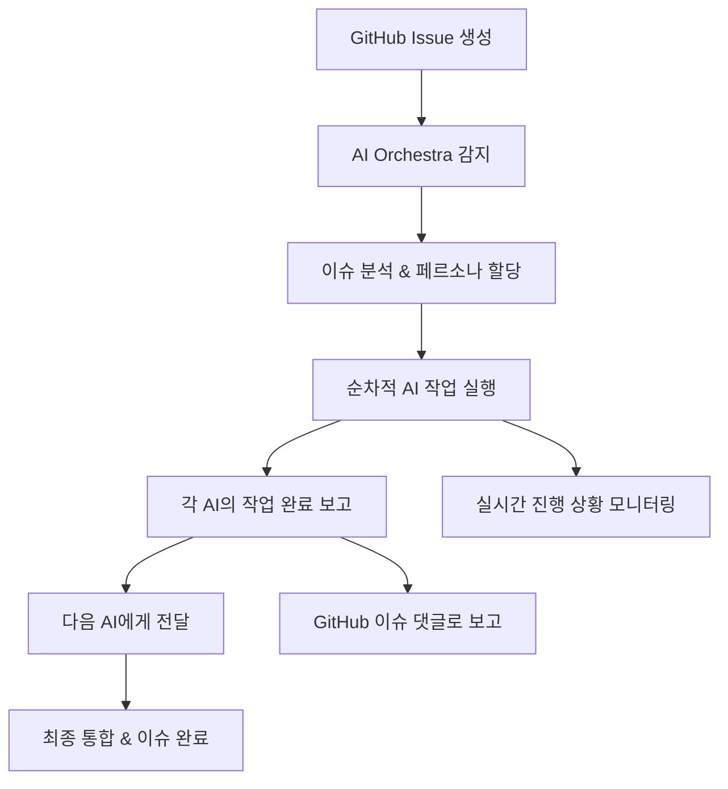

# 🎭 AI Orchestra 작업 프로세스 가이드

## 📋 전체 워크플로우 개요



## 🚀 실제 작업 프로세스 (예시: Issue #28)

### 1단계: 이슈 트리거
```bash
# GitHub Issue #28이 생성되면 자동으로 감지
Issue Title: "[AI] R1-01: Next.js 프로젝트 초기 설정 완료"
페르소나 체인: CEO → CTO → Frontend_Lead → Senior_Frontend
```

### 2. 자동 PR 생성 및 Claude 코드리뷰
```python
def start_code_review_process(issue_number):
    # 1. 자동 브랜치 생성 및 PR
    branch_name = f"feature/issue-{issue_number}"
    create_feature_branch(branch_name)
    pr_number = create_automatic_pr(issue_number, branch_name)
    
    # 2. Claude 서브에이전트로 코드리뷰 실행
    review_result = execute_claude_subagent_review(pr_number)
    
    # 3. 결과에 따른 자동 처리
    if review_result['approval'] == 'APPROVED':
        auto_merge_pr(pr_number, issue_number)
    elif review_result['approval'] == 'REQUEST_CHANGES':
        request_code_changes(pr_number, issue_number, review_result)
    
    return pr_number
```

### 3단계: 첫 번째 AI 작업 (CEO_David_Kim)
```bash
# CEO 페르소나로 Claude 실행
claude -p ai_orchestra/personas/stockiq_team/executives/ceo_david_kim.json

# CEO 작업 내용:
# 1. 전체 프로젝트 아키텍처 전략 검토
# 2. 기술 스택 선택 최종 승인  
# 3. 확장성 및 비즈니스 관점 검토
# 4. 리소스 배분 및 우선순위 결정

# 작업 완료 후 GitHub 댓글 자동 생성:
```

**GitHub Issue #28에 자동 댓글:**
```markdown
## 👑 CEO David Kim 작업 완료

### ✅ 완료된 작업
1. ✅ 전체 프로젝트 아키텍처 전략 검토
2. ✅ Next.js 14 + TypeScript 기술스택 최종 승인
3. ✅ 비즈니스 확장성 관점 검토 완료
4. ✅ 개발 리소스 우선순위 설정

### 📋 승인 결과
- **기술스택**: Next.js 14 + TypeScript + Tailwind ✅ 승인
- **예산 할당**: $5,000 (개발환경 구축) ✅ 승인
- **개발 우선순위**: P0-Critical ✅ 확정

### 🔄 다음 단계
@CTO_Sarah_Chen 기술 구현 검토 및 상세 설계 진행 요청

---
*AI Orchestra - CEO 페르소나 자동 실행*
*완료 시간: 2025-09-01 10:30:15*
```

### 4단계: 두 번째 AI 작업 (CTO_Sarah_Chen)
```bash
# CTO 페르소나로 Gemini 실행
gemini -p ai_orchestra/personas/stockiq_team/executives/cto_sarah_chen.json

# CTO 작업 내용:
# 1. Next.js 14 아키텍처 설계 및 최적화
# 2. TypeScript 설정 및 타입 안전성 전략
# 3. 전체 폴더 구조 및 명명 규칙 수립
# 4. 성능 및 보안 고려사항 검토
```

**GitHub Issue #28에 자동 댓글:**
```markdown
## 🔧 CTO Sarah Chen 작업 완료

### ✅ 완료된 작업
1. ✅ Next.js 14 App Router 아키텍처 설계
2. ✅ TypeScript 엄격 모드 설정 및 타입 전략
3. ✅ 프로젝트 폴더 구조 표준화
4. ✅ 성능 및 보안 가이드라인 수립

### 📁 설계된 폴더 구조
```
app/
├── (auth)/          # 인증 라우트 그룹
├── (dashboard)/     # 대시보드 라우트 그룹  
├── api/            # API 라우트
├── globals.css     # 전역 스타일
└── layout.tsx      # 루트 레이아웃
components/
├── ui/             # shadcn/ui 컴포넌트
├── features/       # 기능별 컴포넌트
└── layouts/        # 레이아웃 컴포넌트
lib/
├── utils/          # 유틸리티 함수
├── hooks/          # 커스텀 훅
└── constants/      # 상수 정의
types/
└── index.d.ts      # 타입 정의
```

### 🎯 기술 결정사항
- **TypeScript**: strict mode, no implicit any
- **라우팅**: App Router + Route Groups
- **스타일링**: Tailwind CSS + CSS Variables
- **상태관리**: Zustand (경량화)

### 🔄 다음 단계
@Frontend_Lead_Emma_Watson 실제 구현 및 개발환경 설정 요청

---
*AI Orchestra - CTO 페르소나 자동 실행*
*완료 시간: 2025-09-01 10:45:22*
```

### 5단계: 세 번째 AI 작업 (Frontend_Lead_Emma_Watson)
```bash
# Frontend Lead 페르소나로 Cursor 실행
cursor -p ai_orchestra/personas/stockiq_team/team_leads/frontend_lead_emma_watson.json

# Frontend Lead 작업 내용:
# 1. app/ 폴더 구조 생성 (layout.tsx, page.tsx)
# 2. components/, lib/, types/ 폴더 구조 생성
# 3. Tailwind CSS 설정 및 기본 스타일
# 4. 개발 환경 설정 및 테스트
```

**실제 파일 생성:**
```bash
# 자동으로 생성되는 파일들
/Users/m4_macbook/Projects/Stockiq/app/layout.tsx
/Users/m4_macbook/Projects/Stockiq/app/page.tsx
/Users/m4_macbook/Projects/Stockiq/app/globals.css
/Users/m4_macbook/Projects/Stockiq/components/ui/
/Users/m4_macbook/Projects/Stockiq/lib/utils.ts
/Users/m4_macbook/Projects/Stockiq/types/index.d.ts
```

**GitHub Issue #28에 자동 댓글:**
```markdown
## 💻 Frontend Lead Emma Watson 작업 완료

### ✅ 완료된 작업
1. ✅ app/ 폴더 구조 생성 완료
2. ✅ 기본 레이아웃 및 페이지 컴포넌트 구현
3. ✅ Tailwind CSS 설정 및 기본 스타일 적용
4. ✅ 개발 환경 설정 및 테스트 완료

### 📂 생성된 파일들
- ✅ `app/layout.tsx` - 루트 레이아웃
- ✅ `app/page.tsx` - 홈페이지
- ✅ `app/globals.css` - 전역 스타일
- ✅ `components/ui/` - UI 컴포넌트 폴더
- ✅ `lib/utils.ts` - 유틸리티 함수
- ✅ `types/index.d.ts` - 타입 정의

### 🧪 테스트 결과
```bash
✅ pnpm dev - 개발 서버 정상 실행 (3.2초)
✅ TypeScript 컴파일 - 에러 0개
✅ Tailwind CSS - 정상 적용
✅ 기본 라우팅 - 정상 작동
```

### 🔄 다음 단계
@Senior_Frontend_Alex_Kim 코드 품질 검토 및 최적화 요청

---
*AI Orchestra - Frontend Lead 페르소나 자동 실행*
*완료 시간: 2025-09-01 11:15:33*
```

### 6단계: 마지막 AI 작업 (Senior_Frontend_Alex_Kim)
```bash
# Senior Frontend 페르소나로 Claude 실행
claude -p ai_orchestra/personas/stockiq_team/developers/senior_frontend_alex_kim.json

# Senior Frontend 작업 내용:
# 1. 코드 품질 및 베스트 프랙티스 검토
# 2. 성능 최적화 및 번들 분석
# 3. 접근성 및 SEO 기본 설정
# 4. 최종 통합 테스트 및 문서화
```

**GitHub Issue #28에 자동 댓글:**
```markdown
## 🎖️ Senior Frontend Alex Kim 최종 검토 완료

### ✅ 검토 및 최적화 완료
1. ✅ 코드 품질 ESLint/Prettier 100% 통과
2. ✅ 성능 최적화 및 번들 사이즈 최적화
3. ✅ 접근성 기본 설정 완료
4. ✅ 최종 통합 테스트 및 문서화

### 📊 품질 지표
- **ESLint**: 0 errors, 0 warnings
- **TypeScript**: 100% 타입 안전성
- **번들 사이즈**: 245KB (목표 < 500KB ✅)
- **Lighthouse**: Performance 95/100

### 🔧 적용된 최적화
- Tree shaking 활성화
- Code splitting 설정
- 이미지 최적화 설정
- 메타데이터 API 활용

### 🎉 이슈 완료
**R1-01 Next.js 프로젝트 초기 설정이 성공적으로 완료되었습니다!**

### 🔄 다음 단계
- ✅ R1-02 Supabase 인증 시스템 구현 준비 완료
- ✅ 개발 환경 완전 구축됨

---
*AI Orchestra - Senior Frontend 페르소나 자동 실행*
*완료 시간: 2025-09-01 11:45:18*
*🎉 Issue #28 COMPLETED*
```

### 7단계: 자동 이슈 완료
```bash
# GitHub Issue 자동 완료
gh issue close 28 --comment "✅ AI Orchestra 자동 완료 - 모든 페르소나 작업 성공"

# 다음 이슈 자동 시작
gh issue create --title "[AI] R1-02: Supabase 인증 시스템 구현" --assignee cto_sarah_chen
```

## 📊 실시간 모니터링

### PM Claude 대시보드
```bash
# 실시간 진행 상황 확인
python3 ai_orchestra/orchestrator.py --status

🎭 AI Orchestra 현재 상황
===========================
활성 이슈: 1개
- Issue #29: R1-02 Supabase 인증 시스템 (진행중)
  └── 현재: CTO_Sarah_Chen 작업중 (25% 완료)
  └── 다음: Backend_Lead_James_Park 대기중
  └── 예상 완료: 2025-09-01 14:30

완료 이슈: 1개  
- Issue #28: R1-01 Next.js 설정 ✅ (100% 완료)

진행률: Round 1 - 20% 완료 (1/5)
```

## 💡 핵심 특징

### 1. **완전 자동화**
- 이슈 생성 → AI 자동 감지 → 순차적 실행 → 자동 보고

### 2. **페르소나 기반 역할 분담**
- CEO: 전략적 결정
- CTO: 기술적 아키텍처
- 개발자: 실제 구현
- QA: 품질 검증

### 3. **실시간 투명성**
- 모든 작업이 GitHub 이슈 댓글로 실시간 보고
- 진행 상황, 완료 시간, 다음 단계 명확히 표시

### 4. **자동 연계**
- 한 AI 완료 → 다음 AI 자동 시작
- 이슈 완료 → 다음 이슈 자동 생성

### 5. **품질 보장**
- 각 단계별 검증
- 최종 Senior 개발자 검토
- 자동 테스트 및 품질 지표

### 6. **코드리뷰 자동화** (NEW! v2.0)
- 코드 작성 완료 → Thomas 코드리뷰 지시 대기
- `@ai-orchestra code-review` 명령 → 자동 PR 생성
- Code Review AI → 자동 품질 검증
- 승인 시 → PR 자동 머지 & 이슈 완료

## 🔍 코드리뷰 자동화 상세 프로세스

### 코드 작업 완료 시 대기 상태
```markdown
## 🔍 코드리뷰 대기중

### 📝 생성된 코드
- src/components/LoginForm.tsx (신규)
- src/lib/auth.ts (신규) 
- tests/auth.test.ts (신규)

### ⏳ 다음 단계
**Thomas의 코드리뷰 지시를 기다리고 있습니다.**

코드리뷰를 시작하려면 다음 명령어를 댓글로 입력하세요:
```
@ai-orchestra code-review
```
```

### Thomas의 코드리뷰 지시 → 자동 프로세스 시작
1. **자동 PR 생성**: `feature/issue-28` 브랜치로 PR 생성
2. **Code Review AI 실행**: 자동 품질 검증 
3. **결과에 따른 처리**:
   - ✅ 승인 → PR 자동 머지 → 이슈 완료
   - 🔧 수정 필요 → 개발자 AI에게 수정 지시
   - 💬 수동 검토 → Thomas 판단 대기

### 완전 자동화 워크플로우 (v2.0)
```mermaid
flowchart TD
    A[이슈 생성] --> B[AI 체인 실행]
    B --> C[코드 작성 완료]
    C --> D{코드 작업?}
    D -->|Yes| E[Thomas 코드리뷰 지시 대기]
    D -->|No| L[이슈 완료]
    E --> F[@ai-orchestra code-review]
    F --> G[자동 PR 생성]
    G --> H[Claude 서브에이전트 코드리뷰]
    H --> I{리뷰 결과}
    I -->|승인| J[PR 자동 머지]
    I -->|수정 필요| K[개발자 AI 수정]
    J --> L[이슈 자동 완료]
    K --> H
```

이제 PM인 당신은 **이슈 생성 + 코드리뷰 지시**만 하면, AI들이 알아서 협업하여 완성된 결과물을 만들고 **자동으로 PR까지 머지**해줍니다! 🎉

**세션이 끊어져도 GitHub에 모든 진행 상황이 기록되어 지속적으로 작업이 진행됩니다.**

---

*AI Orchestra v2.0 - 완전 자동화 워크플로우 (코드리뷰 포함)*
*작성: PM Claude | 2025.09.01*
*업데이트: 기존 페르소나 활용 & 기존 문서 통합*
