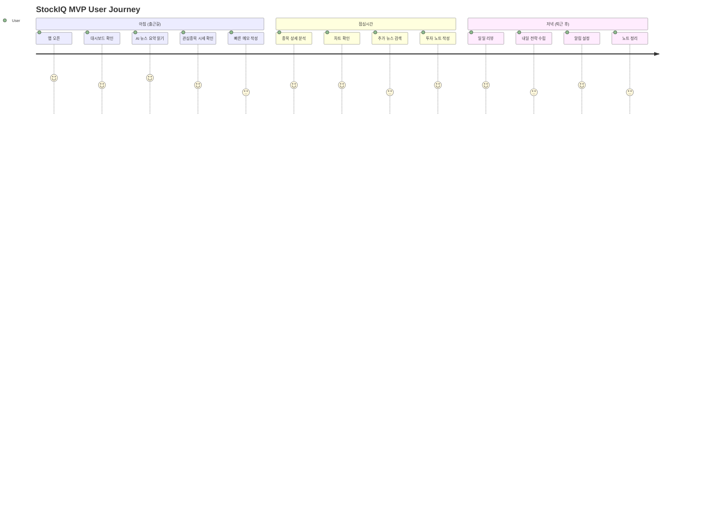
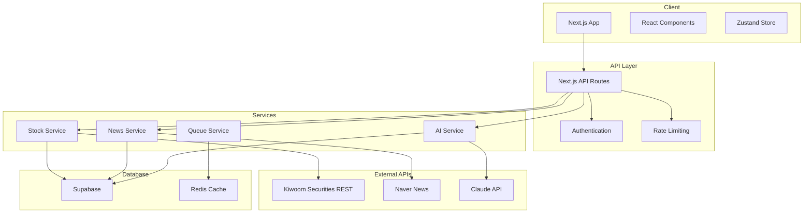

# 📱 StockIQ MVP 개발 기획서

## 1. Executive Summary

### 1.1 프로젝트 개요
- **제품명**: StockIQ MVP
- **버전**: 1.0.0
- **개발 기간**: 8주 (2025.01.30 - 2025.03.26)
- **예산**: 개발 인건비 제외, 운영비 월 $100
- **목표**: 개인 투자자를 위한 AI 기반 투자 정보 통합 플랫폼 MVP

### 1.2 핵심 가치 제안
```
"매일 1시간 걸리던 투자 정보 수집을 5분으로 단축"
- 흩어진 정보를 한 곳에서
- AI가 핵심만 요약
- 실시간 알림으로 기회 포착
```

### 1.3 목표 지표
- **사용자**: 50명 (Beta 기간)
- **DAU**: 20명
- **세션 시간**: 평균 5분
- **AI 요약 만족도**: 4.0/5.0

### 1.4 Reference
- **Core Vision**: [AI Trading Vision](./AI_TRADING_VISION.md) - *The strict guideline for Intelligence & Memory architecture.*

---

## 2. MVP 범위 정의

### 2.1 포함 기능 (In Scope) ✅

#### 핵심 기능 (Must Have)
1. **사용자 인증**
   - 이메일 회원가입/로그인
   - 비밀번호 재설정
   - 세션 관리

2. **주식 시세 조회**
   - 국내 주식 실시간 시세
   - 관심종목 등록/관리 (최대 10개)
   - 기본 차트 (일봉)

3. **AI 뉴스 요약**
   - 종목별 뉴스 수집 (일 10건)
   - AI 3줄 요약
   - 감정 분석 (긍정/중립/부정)

4. **대시보드**
   - 관심종목 요약 뷰
   - 오늘의 주요 뉴스
   - 시장 동향 요약

5. **투자 노트**
   - 종목별 메모 작성
   - 마크다운 지원
   - 기본 템플릿 제공

#### 부가 기능 (Nice to Have)
1. **기술적 분석**
   - 이동평균선 (20일, 60일)
   - RSI 지표
   - 거래량 분석

2. **알림 기능**
   - 목표가 도달 알림
   - 중요 뉴스 알림
   - 이메일 알림

3. **내보내기**
   - PDF 다운로드
   - Excel 내보내기

### 2.2 제외 기능 (Out of Scope) ❌

1. **제외되는 기능**
   - ❌ 해외 주식
   - ❌ 암호화폐
   - ❌ 자동 매매
   - ❌ 포트폴리오 분석
   - ❌ 백테스팅
   - ❌ 소셜 기능
   - ❌ 모바일 앱
   - ❌ 유료 구독
   - ❌ 다국어 지원
   - ❌ 실시간 채팅

2. **Post-MVP 고려사항**
   - Phase 2: 해외 주식, 포트폴리오
   - Phase 3: 자동 매매, 백테스팅
   - Phase 4: 모바일 앱, 소셜 기능

---

## 3. User Persona & Journey

### 3.1 Target Persona

#### Primary Persona: "직장인 투자자 김대리"
```yaml
인구통계:
  나이: 32세
  직업: IT 회사 대리
  투자경력: 3년
  월 투자금: 200만원

Pain Points:
  - 출퇴근 시간에만 투자 정보 확인 가능
  - 여러 앱/사이트를 돌아다니며 정보 수집
  - 뉴스가 너무 많아 핵심 파악 어려움
  - 투자 기록 관리 체계 부족

Needs:
  - 빠른 정보 요약
  - 신뢰할 수 있는 분석
  - 간단한 기록 관리
  - 적시 알림
```

### 3.2 User Journey Map



---

## 4. Functional Requirements

### 4.1 인증 시스템

| ID | Feature | Description | Priority | Acceptance Criteria |
|----|---------|-------------|----------|-------------------|
| AUTH-01 | 회원가입 | 이메일/비밀번호로 가입 | P0 | - 이메일 중복 체크<br>- 비밀번호 8자 이상<br>- 이메일 인증 |
| AUTH-02 | 로그인 | 이메일/비밀번호 로그인 | P0 | - 세션 유지 24시간<br>- Remember me 옵션 |
| AUTH-03 | 비밀번호 재설정 | 이메일로 재설정 링크 | P1 | - 1시간 유효<br>- 일회용 링크 |
| AUTH-04 | 프로필 관리 | 기본 정보 수정 | P1 | - 닉네임 변경<br>- 프로필 이미지 |

### 4.2 주식 데이터

| ID | Feature | Description | Priority | Acceptance Criteria |
|----|---------|-------------|----------|-------------------|
| STOCK-01 | 시세 조회 | 실시간 주가 정보 | P0 | - 1분 단위 업데이트<br>- 전일 대비 등락률 |
| STOCK-02 | 종목 검색 | 종목명/코드 검색 | P0 | - 자동완성<br>- 최근 검색 기록 |
| STOCK-03 | 관심종목 | 즐겨찾기 관리 | P0 | - 최대 10개<br>- 드래그 정렬 |
| STOCK-04 | 차트 | 기본 차트 표시 | P0 | - 일/주/월 봉<br>- 거래량 표시 |
| STOCK-05 | 기술적 지표 | MA, RSI 등 | P1 | - 이동평균선<br>- RSI 표시 |

### 4.3 AI 기능

| ID | Feature | Description | Priority | Acceptance Criteria |
|----|---------|-------------|----------|-------------------|
| AI-01 | 뉴스 수집 | 자동 뉴스 크롤링 | P0 | - 시간당 1회<br>- 종목당 10건 |
| AI-02 | 뉴스 요약 | AI 3줄 요약 | P0 | - 3초 이내 생성<br>- 한글 요약 |
| AI-03 | 감정 분석 | 긍정/부정 판단 | P0 | - 점수 표시 (-1~1)<br>- 3단계 분류 |
| AI-04 | 키워드 추출 | 핵심 키워드 | P1 | - 5개 키워드<br>- 빈도 기반 |
| AI-05 | 비용 관리 | AI API 비용 추적 | P0 | - 일 $10 제한<br>- 실시간 모니터링 |

### 4.4 사용자 기능

| ID | Feature | Description | Priority | Acceptance Criteria |
|----|---------|-------------|----------|-------------------|
| USER-01 | 대시보드 | 메인 화면 | P0 | - 관심종목 카드<br>- 뉴스 요약 |
| USER-02 | 투자 노트 | 메모 작성 | P0 | - 마크다운 지원<br>- 자동 저장 |
| USER-03 | 알림 설정 | 가격/뉴스 알림 | P1 | - 목표가 설정<br>- 이메일 발송 |
| USER-04 | 검색/필터 | 콘텐츠 검색 | P1 | - 종목 필터<br>- 날짜 범위 |
| USER-05 | 내보내기 | PDF/Excel | P1 | - 노트 PDF<br>- 데이터 Excel |

---

## 5. Technical Architecture

### 5.1 System Architecture



### 5.2 Tech Stack Decision

| Category | Technology | Rationale |
|----------|------------|-----------|
| **Frontend** | Next.js 14 | SSR, 빠른 개발, Vercel 호스팅 |
| **UI Library** | shadcn/ui | 커스터마이징 용이, 경량 |
| **State** | Zustand | 간단한 상태 관리, 작은 번들 |
| **Styling** | Tailwind CSS | 빠른 스타일링, 일관성 |
| **Database** | Supabase | 무료 티어, Auth 포함 |
| **Cache** | Upstash Redis | Serverless, 비용 효율 |
| **AI** | Claude Haiku | 저렴, 한글 성능 우수 |
| **Charts** | Recharts | React 친화적, 커스터마이징 |
| **Queue** | Bull | 안정적, Redis 기반 |
| **Hosting** | Vercel | Next.js 최적화, 무료 티어 |

### 5.3 Database Schema

```sql
-- Users Table
CREATE TABLE users (
    id UUID PRIMARY KEY DEFAULT uuid_generate_v4(),
    email VARCHAR(255) UNIQUE NOT NULL,
    name VARCHAR(100),
    avatar_url TEXT,
    created_at TIMESTAMP DEFAULT NOW(),
    updated_at TIMESTAMP DEFAULT NOW()
);

-- Watchlist Table
CREATE TABLE watchlist (
    id UUID PRIMARY KEY DEFAULT uuid_generate_v4(),
    user_id UUID REFERENCES users(id) ON DELETE CASCADE,
    ticker VARCHAR(20) NOT NULL,
    name VARCHAR(100),
    order_index INTEGER,
    created_at TIMESTAMP DEFAULT NOW(),
    UNIQUE(user_id, ticker)
);

-- News Table  
CREATE TABLE news (
    id UUID PRIMARY KEY DEFAULT uuid_generate_v4(),
    ticker VARCHAR(20),
    title TEXT NOT NULL,
    url TEXT NOT NULL,
    published_at TIMESTAMP,
    created_at TIMESTAMP DEFAULT NOW(),
    UNIQUE(url)
);

-- News Summaries Table
CREATE TABLE news_summaries (
    id UUID PRIMARY KEY DEFAULT uuid_generate_v4(),
    news_id UUID REFERENCES news(id) ON DELETE CASCADE,
    summary TEXT NOT NULL,
    sentiment DECIMAL(3,2),
    keywords TEXT[],
    ai_model VARCHAR(50),
    tokens_used INTEGER,
    created_at TIMESTAMP DEFAULT NOW()
);

-- Notes Table
CREATE TABLE notes (
    id UUID PRIMARY KEY DEFAULT uuid_generate_v4(),
    user_id UUID REFERENCES users(id) ON DELETE CASCADE,
    ticker VARCHAR(20),
    title VARCHAR(200),
    content TEXT,
    tags TEXT[],
    embedding VECTOR(1536), -- For RAG
    created_at TIMESTAMP DEFAULT NOW(),
    updated_at TIMESTAMP DEFAULT NOW()
);

-- Trading Memory (Feedback Loop)
CREATE TABLE trading_memories (
    id UUID PRIMARY KEY DEFAULT uuid_generate_v4(),
    user_id UUID REFERENCES users(id),
    decision_type VARCHAR(50), -- 'BUY', 'SELL', 'HOLD'
    reasoning TEXT,
    outcome_score INTEGER, -- 1-5 evaluation
    embedding VECTOR(1536), -- For RAG
    created_at TIMESTAMP DEFAULT NOW()
);

-- Price Alerts Table
CREATE TABLE price_alerts (
    id UUID PRIMARY KEY DEFAULT uuid_generate_v4(),
    user_id UUID REFERENCES users(id) ON DELETE CASCADE,
    ticker VARCHAR(20) NOT NULL,
    target_price DECIMAL(10,2),
    condition VARCHAR(10), -- 'above', 'below'
    is_active BOOLEAN DEFAULT true,
    triggered_at TIMESTAMP,
    created_at TIMESTAMP DEFAULT NOW()
);
```

---

## 6. API Specification

### 6.1 RESTful Endpoints

#### Authentication
```yaml
POST   /api/auth/signup     # 회원가입
POST   /api/auth/login      # 로그인
POST   /api/auth/logout     # 로그아웃
POST   /api/auth/reset      # 비밀번호 재설정
GET    /api/auth/me         # 현재 사용자 정보
```

#### Stock Data
```yaml
GET    /api/stocks/search?q={query}           # 종목 검색
GET    /api/stocks/{ticker}                   # 종목 상세
GET    /api/stocks/{ticker}/quote             # 실시간 시세
GET    /api/stocks/{ticker}/chart?period=1d   # 차트 데이터
```

#### Watchlist
```yaml
GET    /api/watchlist                         # 관심종목 목록
POST   /api/watchlist                         # 관심종목 추가
DELETE /api/watchlist/{ticker}                # 관심종목 삭제
PUT    /api/watchlist/reorder                 # 순서 변경
```

#### News & AI
```yaml
GET    /api/news?ticker={ticker}              # 뉴스 목록
GET    /api/news/{id}/summary                 # AI 요약
POST   /api/ai/summarize                      # 요약 생성
GET    /api/ai/usage                          # AI 사용량
```

#### Notes
```yaml
GET    /api/notes                             # 노트 목록
GET    /api/notes/{id}                        # 노트 상세
POST   /api/notes                             # 노트 생성
PUT    /api/notes/{id}                        # 노트 수정
DELETE /api/notes/{id}                        # 노트 삭제
```

### 6.2 Response Format

```typescript
// Success Response
{
  "success": true,
  "data": {
    // Response data
  },
  "meta": {
    "timestamp": "2025-01-30T10:00:00Z",
    "version": "1.0.0"
  }
}

// Error Response
{
  "success": false,
  "error": {
    "code": "INVALID_REQUEST",
    "message": "Invalid ticker symbol",
    "details": {}
  },
  "meta": {
    "timestamp": "2025-01-30T10:00:00Z",
    "version": "1.0.0"
  }
}
```

---

## 7. UI/UX Design

### 7.1 Design System

#### Color Palette
```css
/* Primary Colors */
--primary-blue: #2563EB     /* 메인 브랜드 */
--primary-green: #10B981    /* 상승/긍정 */
--primary-red: #EF4444      /* 하락/부정 */
--primary-gray: #6B7280     /* 중립 */

/* Background */
--bg-primary: #FFFFFF
--bg-secondary: #F9FAFB
--bg-tertiary: #F3F4F6

/* Text */
--text-primary: #111827
--text-secondary: #6B7280
--text-tertiary: #9CA3AF
```

#### Typography
```css
/* Font Family */
--font-sans: 'Pretendard', -apple-system, sans-serif;
--font-mono: 'JetBrains Mono', monospace;

/* Font Sizes */
--text-xs: 0.75rem;    /* 12px */
--text-sm: 0.875rem;   /* 14px */
--text-base: 1rem;     /* 16px */
--text-lg: 1.125rem;   /* 18px */
--text-xl: 1.25rem;    /* 20px */
--text-2xl: 1.5rem;    /* 24px */
```

### 7.2 Key Screens

#### Dashboard (Desktop)
```
┌─────────────────────────────────────────────┐
│ [Logo] StockIQ    [Search]  [🔔] [Profile]  │
├───────┬─────────────────────────────────────┤
│       │  Good morning, 김대리님 👋           │
│  Nav  │  ┌─────────────────────────────┐    │
│       │  │ 📊 Today's Market          │    │
│  관심 │  │ KOSPI 2,450 ▲1.2%        │    │
│  뉴스 │  │ KOSDAQ 780 ▲0.8%         │    │
│  노트 │  └─────────────────────────────┘    │
│  설정 │                                      │
│       │  My Watchlist (5)                   │
│       │  ┌──────┐ ┌──────┐ ┌──────┐       │
│       │  │삼성  │ │SK   │ │LG   │       │
│       │  │72K  │ │125K │ │85K  │       │
│       │  │▲2.1%│ │▼0.8%│ │▲1.2%│       │
│       │  └──────┘ └──────┘ └──────┘       │
│       │                                      │
│       │  AI News Summary                    │
│       │  ┌─────────────────────────────┐    │
│       │  │• 삼성 3나노 양산 임박        │    │
│       │  │• Fed 금리 동결 전망         │    │
│       │  │• 2차전지 수출 호조         │    │
│       │  └─────────────────────────────┘    │
└───────┴─────────────────────────────────────┘
```

#### Mobile View
```
┌─────────────┐
│ ☰ StockIQ 🔔│
├─────────────┤
│ 안녕하세요! │
│ 김대리님 👋  │
├─────────────┤
│ 📊 Market   │
│ KOSPI ▲1.2% │
├─────────────┤
│ Watchlist   │
│ ┌─────────┐ │
│ │삼성전자  │ │
│ │72,000   │ │
│ │▲2.1%    │ │
│ └─────────┘ │
│ [More...]   │
├─────────────┤
│ 📰 AI News  │
│ • 3나노 양산 │
│ • Fed 동결  │
│ [More...]   │
└─────────────┘
```

---

## 8. Development Plan

### 8.1 Sprint Plan

#### Sprint 1 (Week 1-2): Foundation
```yaml
Goals:
  - 프로젝트 설정 완료
  - 인증 시스템 구현
  - 기본 UI 구성

Deliverables:
  - 로그인/회원가입 페이지
  - 대시보드 레이아웃
  - 데이터베이스 연결

Success Metrics:
  - 회원가입 성공률 > 90%
  - 페이지 로딩 < 3초
```

#### Sprint 2 (Week 3-4): Core Features
```yaml
Goals:
  - 주식 데이터 연동
  - 뉴스 수집 시스템
  - 기본 차트 구현

Deliverables:
  - 실시간 시세 조회
  - 뉴스 피드
  - 종목 상세 페이지

Success Metrics:
  - API 응답 < 1초
  - 뉴스 수집 성공률 > 95%
```

#### Sprint 3 (Week 5-6): AI Integration
```yaml
Goals:
  - AI 요약 엔진
  - 스마트 노트
  - 기술적 분석

Deliverables:
  - 뉴스 요약 기능
  - 투자 노트 에디터
  - 차트 지표

Success Metrics:
  - 요약 생성 < 3초
  - AI 비용 < $10/day
```

#### Sprint 4 (Week 7-8): Polish
```yaml
Goals:
  - UX 개선
  - 성능 최적화
  - 버그 수정

Deliverables:
  - 모바일 반응형
  - 알림 시스템
  - 내보내기 기능

Success Metrics:
  - Lighthouse > 90
  - 모바일 사용성 100%
```

### 8.2 Resource Requirements

#### Human Resources
- **개발자**: 1명 (Thomas)
- **디자이너**: 0명 (템플릿 활용)
- **QA**: 0명 (자체 테스트)

#### Infrastructure Costs (Monthly)
| Service | Free Tier | Estimated Usage | Cost |
|---------|-----------|-----------------|------|
| Vercel | 100GB | 50GB | $0 |
| Supabase | 500MB DB | 200MB | $0 |
| Upstash | 10K commands | 8K | $0 |
| Claude API | - | 300K tokens/day | $30 |
| Stock API | 100 calls/min | 80 calls/min | $20 |
| **Total** | | | **$50/month** |

---

## 9. Risk Management

### 9.1 Risk Matrix

| Risk | Probability | Impact | Mitigation |
|------|------------|--------|------------|
| **API 제한** | High | High | 다중 Provider, 캐싱 |
| **AI 비용 초과** | High | Medium | 비용 모니터링, 제한 |
| **성능 이슈** | Medium | High | 최적화, CDN |
| **보안 취약점** | Low | High | 보안 감사, HTTPS |
| **사용자 부족** | Medium | Medium | 마케팅, 피드백 |

### 9.2 Contingency Plans

#### Plan A: API 제한 대응
```yaml
Trigger: API 호출 제한 도달
Action:
  1. Fallback Provider 자동 전환
  2. 캐시된 데이터 제공
  3. 사용자 알림
Recovery: 다음 날 자동 복구
```

#### Plan B: AI 비용 초과
```yaml
Trigger: 일일 비용 $8 초과
Action:
  1. 저렴한 모델로 전환
  2. 요약 품질 하향
  3. 관리자 알림
Recovery: 익일 리셋
```

---

## 10. Success Criteria

### 10.1 MVP Success Metrics

#### Quantitative Metrics
| Metric | Target | Measurement |
|--------|--------|-------------|
| **사용자 수** | 50명 | Google Analytics |
| **DAU** | 20명 | Custom Analytics |
| **세션 시간** | 5분 | GA Average |
| **Retention (7d)** | 40% | Cohort Analysis |
| **AI 정확도** | 85% | User Feedback |
| **페이지 속도** | <2초 | Lighthouse |
| **에러율** | <1% | Sentry |
| **가동시간** | >99% | Uptime Robot |

#### Qualitative Metrics
- 사용자 만족도: NPS > 40
- AI 요약 품질: 4.0/5.0
- UI/UX 사용성: SUS > 70
- 피드백 긍정률: > 70%

### 10.2 Go/No-Go Decision Criteria

#### Go Criteria (진행)
- ✅ 핵심 기능 100% 구현
- ✅ 50명 이상 Beta 사용자
- ✅ 일일 활성 사용자 20명
- ✅ 치명적 버그 0건
- ✅ 월 운영비 < $100

#### No-Go Criteria (중단)
- ❌ 핵심 기능 미완성
- ❌ 사용자 20명 미만
- ❌ 치명적 보안 이슈
- ❌ 월 운영비 > $200
- ❌ 법적 이슈 발생

---

## 11. Post-MVP Roadmap

### Phase 2 (Month 4-6)
- 해외 주식 지원
- 포트폴리오 분석
- 고급 차트 기능
- 유료 구독 모델

### Phase 3 (Month 7-9)
- 모바일 앱 출시
- 자동 매매 알고리즘
- 백테스팅 기능
- API 제공

### Phase 4 (Month 10-12)
- 소셜 기능
- AI 투자 조언
- 글로벌 확장
- 기관 투자자 버전

---

## 12. Appendix

### A. Competitive Analysis

| Feature | StockIQ | 증권사 앱 | 뉴스 앱 | AI 서비스 |
|---------|---------|-----------|---------|-----------|
| 실시간 시세 | ✅ | ✅ | ❌ | ❌ |
| AI 요약 | ✅ | ❌ | ❌ | ✅ |
| 투자 노트 | ✅ | ⚪ | ❌ | ❌ |
| 통합 대시보드 | ✅ | ⚪ | ❌ | ❌ |
| 무료 | ✅ | ✅ | ⚪ | ❌ |

### B. User Interview Insights

#### Key Findings
1. **정보 과부하**: "뉴스가 너무 많아 핵심을 못 찾겠어요"
2. **시간 부족**: "출퇴근 시간 5분만 확인해요"
3. **기록 필요**: "투자 일지를 쓰고 싶은데 귀찮아요"
4. **신뢰성**: "AI 분석이 정말 믿을만한가요?"

### C. Technical Debt Considerations

#### Acceptable Debt (MVP)
- 기본적인 에러 핸들링
- 수동 배포 프로세스
- 단순한 캐싱 전략
- 기본 보안 설정

#### Unacceptable Debt
- 데이터 무결성 이슈
- 보안 취약점
- 확장 불가능한 아키텍처
- 테스트 없는 핵심 기능

---

## 📝 Sign-off

### Stakeholders
| Role | Name | Date | Signature |
|------|------|------|-----------|
| Project Owner | Thomas | 2025.01.30 | _______ |
| Developer | Thomas | 2025.01.30 | _______ |
| Advisor | Claude | 2025.01.30 | _______ |

### Document History
| Version | Date | Author | Changes |
|---------|------|--------|---------|
| 1.0.0 | 2025.01.30 | Thomas | Initial draft |

---

*"Start small, think big, move fast"*

*최종 업데이트: 2025년 1월 30일*
*작성자: Thomas with Claude*