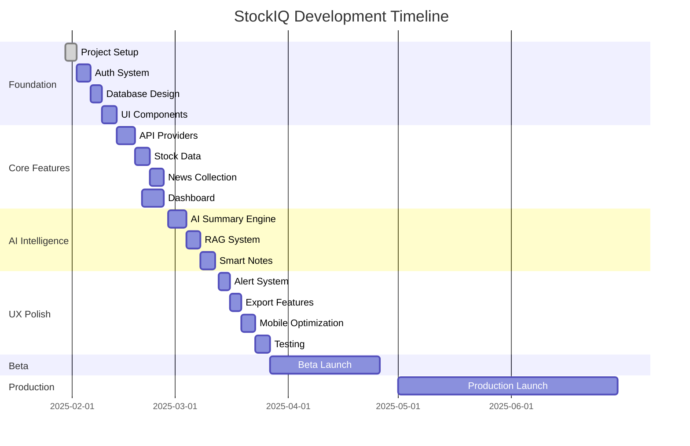

# 🗺️ StockIQ 프로젝트 로드맵

## 📅 프로젝트 타임라인
- **시작일**: 2025년 1월 30일
- **MVP 완료**: 2025년 3월 31일 (8주)
- **Beta 출시**: 2025년 4월 30일
- **정식 출시**: 2025년 6월 30일

---

## 🎯 마일스톤 (Milestones)

### M1: Foundation (Week 1-2)
**기간**: 2025.01.30 - 2025.02.12
**목표**: 프로젝트 기반 구축 및 개발 환경 설정

#### 주요 성과물
- ✅ 프로젝트 초기 설정 완료
- ⬜ 인증 시스템 구현
- ⬜ 데이터베이스 스키마 설계
- ⬜ 기본 UI 컴포넌트 라이브러리
- ⬜ CI/CD 파이프라인 구축

#### Success Criteria
- 사용자 회원가입/로그인 가능
- 기본 페이지 라우팅 작동
- 데이터베이스 연결 성공
- Vercel 자동 배포 설정

---

### M2: Core Data Integration (Week 3-4)
**기간**: 2025.02.13 - 2025.02.26
**목표**: 핵심 데이터 수집 및 표시 기능 구현

#### 주요 성과물
- ⬜ 주식 API Provider 시스템
- ⬜ 실시간 시세 조회
- ⬜ 뉴스 수집 시스템
- ⬜ 대시보드 페이지
- ⬜ 종목 상세 페이지

#### Success Criteria
- 3개 이상 API Provider 통합
- 실시간 시세 업데이트 (1분 주기)
- 일 100건 이상 뉴스 수집
- 대시보드 로딩 < 2초

---

### M3: AI Intelligence (Week 5-6)
**기간**: 2025.02.27 - 2025.03.12
**목표**: AI 기반 분석 및 요약 기능 구현

#### 주요 성과물
- ⬜ AI 요약 엔진
- ⬜ RAG 시스템 구축
- ⬜ 스마트 노트 시스템
- ⬜ 기술적 차트 분석
- ⬜ 테마별 클러스터링

#### Success Criteria
- 뉴스 요약 생성 < 3초
- 요약 정확도 > 85%
- AI 일일 비용 < $10
- 캐시 히트율 > 60%

---

### M4: User Experience (Week 7-8)
**기간**: 2025.03.13 - 2025.03.26
**목표**: 사용자 경험 최적화 및 부가 기능

#### 주요 성과물
- ⬜ 알림 시스템
- ⬜ 내보내기 기능
- ⬜ 모바일 최적화
- ⬜ 성능 최적화
- ⬜ 사용자 테스트

#### Success Criteria
- 모바일 반응형 100%
- PWA 지원
- Lighthouse 점수 > 90
- 사용자 만족도 > 4.0/5.0

---

### M5: Beta Launch (Week 9-12)
**기간**: 2025.03.27 - 2025.04.30
**목표**: Beta 버전 출시 및 피드백 수렴

#### 주요 성과물
- ⬜ 버그 수정 및 안정화
- ⬜ 사용자 피드백 시스템
- ⬜ 분석 도구 통합
- ⬜ 문서화 완성
- ⬜ 마케팅 준비

#### Success Criteria
- Beta 사용자 50명 확보
- 크리티컬 버그 0건
- 일일 활성 사용자 20명
- NPS 점수 > 40

---

### M6: Production Launch (Week 13-16)
**기간**: 2025.05.01 - 2025.06.30
**목표**: 정식 서비스 출시

#### 주요 성과물
- ⬜ 유료 구독 시스템
- ⬜ 고급 분석 기능
- ⬜ 포트폴리오 관리
- ⬜ 소셜 기능
- ⬜ 글로벌 시장 지원

#### Success Criteria
- MAU 500명
- 유료 전환율 > 5%
- 서버 가동률 > 99.9%
- 앱스토어 평점 > 4.5

---

## 🔄 개발 단계별 진행 상태

---

## 📊 위험 요소 및 대응 방안

### 🔴 High Risk
| 위험 요소 | 발생 확률 | 영향도 | 대응 방안 |
|----------|----------|--------|----------|
| API 제한/차단 | 중 | 높음 | 다중 Provider 구현, Fallback 메커니즘 |
| AI 비용 초과 | 높음 | 중간 | 비용 모니터링, 캐싱 전략, 모델 선택 최적화 |
| 성능 이슈 | 중 | 높음 | 프로파일링, 코드 스플리팅, CDN 활용 |

### 🟡 Medium Risk
| 위험 요소 | 발생 확률 | 영향도 | 대응 방안 |
|----------|----------|--------|----------|
| 법규 제약 | 낮음 | 높음 | 법률 자문, 면책 조항, 투자 조언 제한 |
| 데이터 정확성 | 중 | 중간 | 다중 소스 검증, 사용자 피드백 |
| 확장성 문제 | 낮음 | 중간 | 마이크로서비스 준비, 캐시 레이어 |

### 🟢 Low Risk
| 위험 요소 | 발생 확률 | 영향도 | 대응 방안 |
|----------|----------|--------|----------|
| UI/UX 이슈 | 중 | 낮음 | 사용자 테스트, A/B 테스트 |
| 경쟁 서비스 | 높음 | 낮음 | 차별화 기능, 빠른 반복 |

---

## 🎯 핵심 성과 지표 (KPIs)

### 기술 지표
| 지표 | Week 4 | Week 8 | Week 12 | Week 16 |
|------|--------|--------|---------|---------|
| API 응답시간 | < 1s | < 500ms | < 300ms | < 200ms |
| 페이지 로딩 | < 3s | < 2s | < 1.5s | < 1s |
| 에러율 | < 5% | < 2% | < 1% | < 0.5% |
| 가동시간 | > 95% | > 98% | > 99% | > 99.9% |

### 비즈니스 지표
| 지표 | Week 4 | Week 8 | Week 12 | Week 16 |
|------|--------|--------|---------|---------|
| 사용자 수 | 10 | 50 | 200 | 500 |
| DAU | 5 | 20 | 80 | 200 |
| 세션 시간 | 3분 | 5분 | 10분 | 15분 |
| 리텐션 (7일) | 20% | 40% | 50% | 60% |

### AI 성과 지표
| 지표 | Week 4 | Week 8 | Week 12 | Week 16 |
|------|--------|--------|---------|---------|
| 요약 생성 시간 | < 5s | < 3s | < 2s | < 1s |
| 요약 정확도 | > 70% | > 85% | > 90% | > 95% |
| 일일 AI 비용 | < $20 | < $10 | < $8 | < $5 |
| 캐시 히트율 | > 30% | > 60% | > 70% | > 80% |

---

## 🚀 출시 전략

### Phase 1: Closed Alpha (Week 1-8)
- 내부 테스트
- 핵심 기능 검증
- 버그 수정

### Phase 2: Open Beta (Week 9-12)
- 초대 기반 Beta
- 사용자 피드백 수집
- 기능 개선

### Phase 3: Public Launch (Week 13-16)
- 정식 출시
- 마케팅 캠페인
- 유료 플랜 도입

---

## 📈 성장 전략

### 단기 (0-3개월)
- MVP 기능 완성
- 초기 사용자 확보
- 피드백 기반 개선

### 중기 (3-6개월)
- 기능 확장
- 유료 모델 도입
- 파트너십 구축

### 장기 (6-12개월)
- 글로벌 확장
- AI 고도화
- 플랫폼 생태계 구축

---

*최종 업데이트: 2025년 1월 30일*
*작성자: Thomas with Claude*