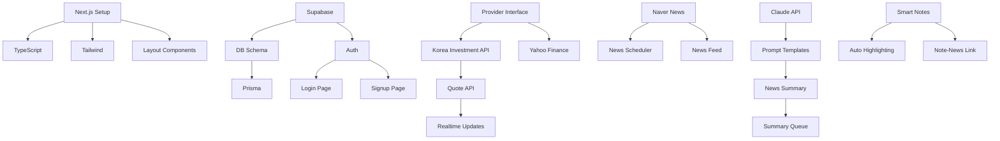

# 📋 StockIQ Task Table (전체 작업 목록)

## 📌 Task 우선순위 정의
- 🔴 **P0**: Critical - 즉시 필요 (MVP 필수)
- 🟡 **P1**: High - 중요함 (MVP 권장)
- 🟢 **P2**: Medium - 있으면 좋음 (Post-MVP)
- ⚪ **P3**: Low - 나중에 (Future)

---

## 🏗️ Foundation Tasks (Week 1-2)

| ID | Task | Priority | Est. Hours | Status | Assignee | Dependencies | Notes |
|----|------|----------|------------|--------|----------|--------------|-------|
| F01 | Next.js 프로젝트 초기 설정 | 🔴 P0 | 2h | ✅ Done | Thomas | - | 완료 |
| F02 | TypeScript 설정 | 🔴 P0 | 1h | ✅ Done | Thomas | F01 | 완료 |
| F03 | Tailwind CSS 설정 | 🔴 P0 | 1h | ✅ Done | Thomas | F01 | 완료 |
| F04 | ESLint/Prettier 설정 | 🟡 P1 | 2h | ⬜ Todo | Thomas | F01 | |
| F05 | Git hooks (Husky) 설정 | 🟡 P1 | 1h | ⬜ Todo | Thomas | F04 | |
| F06 | Supabase 프로젝트 생성 | 🔴 P0 | 1h | ⬜ Todo | Thomas | - | |
| F07 | Supabase Auth 연동 | 🔴 P0 | 4h | ⬜ Todo | Thomas | F06 | |
| F08 | 데이터베이스 스키마 설계 | 🔴 P0 | 3h | ⬜ Todo | Thomas | F06 | |
| F09 | Prisma 설정 | 🔴 P0 | 2h | ⬜ Todo | Thomas | F08 | |
| F10 | 기본 레이아웃 컴포넌트 | 🔴 P0 | 3h | ⬜ Todo | Thomas | F03 | |
| F11 | Header/Navigation | 🔴 P0 | 2h | ⬜ Todo | Thomas | F10 | |
| F12 | Sidebar 컴포넌트 | 🔴 P0 | 2h | ⬜ Todo | Thomas | F10 | |
| F13 | Footer 컴포넌트 | 🟢 P2 | 1h | ⬜ Todo | Thomas | F10 | |
| F14 | 로그인 페이지 | 🔴 P0 | 3h | ⬜ Todo | Thomas | F07 | |
| F15 | 회원가입 페이지 | 🔴 P0 | 3h | ⬜ Todo | Thomas | F07 | |
| F16 | 비밀번호 재설정 | 🟡 P1 | 2h | ⬜ Todo | Thomas | F07 | |
| F17 | 프로필 페이지 | 🟡 P1 | 2h | ⬜ Todo | Thomas | F07 | |
| F18 | shadcn/ui 설정 | 🔴 P0 | 2h | ⬜ Todo | Thomas | F03 | |
| F19 | 기본 UI 컴포넌트 추가 | 🔴 P0 | 3h | ⬜ Todo | Thomas | F18 | |
| F20 | 환경변수 설정 | 🔴 P0 | 1h | ⬜ Todo | Thomas | - | |
| F21 | Vercel 배포 설정 | 🔴 P0 | 2h | ⬜ Todo | Thomas | F01 | |
| F22 | GitHub Actions CI/CD | 🟡 P1 | 3h | ⬜ Todo | Thomas | F21 | |
| F23 | 에러 페이지 (404, 500) | 🟡 P1 | 2h | ⬜ Todo | Thomas | F10 | |
| F24 | Loading 컴포넌트 | 🔴 P0 | 1h | ⬜ Todo | Thomas | F19 | |
| F25 | 테스트 환경 설정 | 🟡 P1 | 3h | ⬜ Todo | Thomas | F01 | |

**Subtotal**: 52h (6.5 days)

---

## 📊 Core Data Integration Tasks (Week 3-4)

| ID | Task | Priority | Est. Hours | Status | Assignee | Dependencies | Notes |
|----|------|----------|------------|--------|----------|--------------|-------|
| D01 | Provider Interface 설계 | 🔴 P0 | 3h | ⬜ Todo | Thomas | - | |
| D02 | 한국투자증권 API 연동 | 🔴 P0 | 6h | ⬜ Todo | Thomas | D01 | |
| D03 | Yahoo Finance Provider | 🟡 P1 | 4h | ⬜ Todo | Thomas | D01 | |
| D04 | Alpha Vantage Provider | 🟢 P2 | 4h | ⬜ Todo | Thomas | D01 | |
| D05 | Provider Factory 구현 | 🔴 P0 | 2h | ⬜ Todo | Thomas | D01 | |
| D06 | 시세 조회 API Route | 🔴 P0 | 3h | ⬜ Todo | Thomas | D02 | |
| D07 | 종목 검색 기능 | 🔴 P0 | 3h | ⬜ Todo | Thomas | D02 | |
| D08 | 관심종목 CRUD | 🔴 P0 | 4h | ⬜ Todo | Thomas | F09 | |
| D09 | 네이버 뉴스 API 연동 | 🔴 P0 | 4h | ⬜ Todo | Thomas | - | |
| D10 | NewsAPI.org 연동 | 🟡 P1 | 3h | ⬜ Todo | Thomas | - | |
| D11 | RSS 피드 파서 | 🟡 P1 | 3h | ⬜ Todo | Thomas | - | |
| D12 | 뉴스 수집 스케줄러 | 🔴 P0 | 4h | ⬜ Todo | Thomas | D09 | |
| D13 | Bull Queue 설정 | 🔴 P0 | 3h | ⬜ Todo | Thomas | - | |
| D14 | Redis 연동 (Upstash) | 🔴 P0 | 2h | ⬜ Todo | Thomas | D13 | |
| D15 | 대시보드 페이지 UI | 🔴 P0 | 6h | ⬜ Todo | Thomas | F10 | |
| D16 | 종목 카드 컴포넌트 | 🔴 P0 | 3h | ⬜ Todo | Thomas | D15 | |
| D17 | 실시간 시세 업데이트 | 🔴 P0 | 4h | ⬜ Todo | Thomas | D06 | |
| D18 | 종목 상세 페이지 | 🔴 P0 | 5h | ⬜ Todo | Thomas | D06 | |
| D19 | 기본 차트 컴포넌트 | 🔴 P0 | 4h | ⬜ Todo | Thomas | D18 | |
| D20 | 뉴스 피드 컴포넌트 | 🔴 P0 | 3h | ⬜ Todo | Thomas | D09 | |
| D21 | 데이터 캐싱 전략 | 🟡 P1 | 3h | ⬜ Todo | Thomas | D14 | |
| D22 | API Rate Limiting | 🟡 P1 | 2h | ⬜ Todo | Thomas | D06 | |
| D23 | WebSocket 연결 | 🟡 P1 | 4h | ⬜ Todo | Thomas | D17 | |
| D24 | 에러 핸들링 | 🔴 P0 | 3h | ⬜ Todo | Thomas | D06 | |
| D25 | API 로깅 시스템 | 🟡 P1 | 2h | ⬜ Todo | Thomas | D06 | |

**Subtotal**: 82h (10.25 days)

---

## 🤖 AI Intelligence Tasks (Week 5-6)

| ID | Task | Priority | Est. Hours | Status | Assignee | Dependencies | Notes |
|----|------|----------|------------|--------|----------|--------------|-------|
| A01 | Claude API 연동 | 🔴 P0 | 3h | ⬜ Todo | Thomas | - | |
| A02 | OpenAI API 연동 (백업) | 🟡 P1 | 2h | ⬜ Todo | Thomas | - | |
| A03 | 프롬프트 템플릿 시스템 | 🔴 P0 | 4h | ⬜ Todo | Thomas | A01 | |
| A04 | 헤드라인 필터링 로직 | 🔴 P0 | 3h | ⬜ Todo | Thomas | A03 | |
| A05 | 뉴스 요약 생성 | 🔴 P0 | 5h | ⬜ Todo | Thomas | A03 | |
| A06 | 감정 분석 기능 | 🟡 P1 | 3h | ⬜ Todo | Thomas | A05 | |
| A07 | 키워드 추출 | 🟡 P1 | 3h | ⬜ Todo | Thomas | A05 | |
| A08 | 요약 큐 시스템 | 🔴 P0 | 4h | ⬜ Todo | Thomas | D13, A05 | |
| A09 | AI 비용 관리자 | 🔴 P0 | 3h | ⬜ Todo | Thomas | A01 | |
| A10 | Pinecone Vector DB 설정 | 🟡 P1 | 4h | ⬜ Todo | Thomas | - | |
| A11 | 문서 임베딩 생성 | 🟡 P1 | 3h | ⬜ Todo | Thomas | A10 | |
| A12 | RAG 컨텍스트 빌더 | 🟡 P1 | 5h | ⬜ Todo | Thomas | A10 | |
| A13 | 스마트 노트 에디터 | 🔴 P0 | 5h | ⬜ Todo | Thomas | - | |
| A14 | 마크다운 렌더러 | 🔴 P0 | 2h | ⬜ Todo | Thomas | A13 | |
| A15 | 노트 템플릿 시스템 | 🟡 P1 | 3h | ⬜ Todo | Thomas | A13 | |
| A16 | 자동 하이라이팅 | 🟡 P1 | 4h | ⬜ Todo | Thomas | A13 | |
| A17 | 노트-뉴스 연결 | 🟡 P1 | 4h | ⬜ Todo | Thomas | A13, A05 | |
| A18 | TradingView Widget | 🔴 P0 | 3h | ⬜ Todo | Thomas | D18 | |
| A19 | 기술적 지표 계산 | 🟡 P1 | 4h | ⬜ Todo | Thomas | D19 | |
| A20 | 차트 설정 저장 | 🟢 P2 | 2h | ⬜ Todo | Thomas | A18 | |
| A21 | 테마별 클러스터링 | 🟡 P1 | 4h | ⬜ Todo | Thomas | D08 | |
| A22 | 섹터 히트맵 | 🟡 P1 | 3h | ⬜ Todo | Thomas | D15 | |
| A23 | AI 성능 모니터링 | 🟡 P1 | 2h | ⬜ Todo | Thomas | A09 | |
| A24 | 캐시 전략 구현 | 🔴 P0 | 3h | ⬜ Todo | Thomas | D14, A05 | |
| A25 | 배치 처리 최적화 | 🟡 P1 | 3h | ⬜ Todo | Thomas | A08 | |

**Subtotal**: 81h (10.1 days)

---

## 💫 User Experience Tasks (Week 7-8)

| ID | Task | Priority | Est. Hours | Status | Assignee | Dependencies | Notes |
|----|------|----------|------------|--------|----------|--------------|-------|
| U01 | 가격 알림 설정 | 🔴 P0 | 4h | ⬜ Todo | Thomas | D08 | |
| U02 | 뉴스 알림 설정 | 🟡 P1 | 3h | ⬜ Todo | Thomas | D09 | |
| U03 | 이메일 알림 전송 | 🟡 P1 | 3h | ⬜ Todo | Thomas | U01 | |
| U04 | 푸시 알림 (PWA) | 🟢 P2 | 4h | ⬜ Todo | Thomas | U01 | |
| U05 | PDF 내보내기 | 🟡 P1 | 4h | ⬜ Todo | Thomas | A13 | |
| U06 | Excel 다운로드 | 🟡 P1 | 3h | ⬜ Todo | Thomas | D15 | |
| U07 | Notion API 연동 | 🟢 P2 | 5h | ⬜ Todo | Thomas | A13 | |
| U08 | 검색 기능 구현 | 🔴 P0 | 4h | ⬜ Todo | Thomas | D07 | |
| U09 | 필터링 시스템 | 🟡 P1 | 3h | ⬜ Todo | Thomas | D15 | |
| U10 | 정렬 기능 | 🟡 P1 | 2h | ⬜ Todo | Thomas | D15 | |
| U11 | 페이지네이션 | 🔴 P0 | 2h | ⬜ Todo | Thomas | D20 | |
| U12 | 무한 스크롤 | 🟡 P1 | 3h | ⬜ Todo | Thomas | D20 | |
| U13 | 반응형 디자인 개선 | 🔴 P0 | 5h | ⬜ Todo | Thomas | F10 | |
| U14 | 모바일 네비게이션 | 🔴 P0 | 3h | ⬜ Todo | Thomas | U13 | |
| U15 | 터치 제스처 | 🟡 P1 | 3h | ⬜ Todo | Thomas | U13 | |
| U16 | PWA 설정 | 🟡 P1 | 3h | ⬜ Todo | Thomas | F01 | |
| U17 | 오프라인 지원 | 🟢 P2 | 4h | ⬜ Todo | Thomas | U16 | |
| U18 | 이미지 최적화 | 🟡 P1 | 2h | ⬜ Todo | Thomas | - | |
| U19 | 코드 스플리팅 | 🟡 P1 | 3h | ⬜ Todo | Thomas | F01 | |
| U20 | 레이지 로딩 | 🟡 P1 | 2h | ⬜ Todo | Thomas | U19 | |
| U21 | SEO 최적화 | 🟡 P1 | 3h | ⬜ Todo | Thomas | F01 | |
| U22 | 접근성 개선 | 🟡 P1 | 3h | ⬜ Todo | Thomas | F10 | |
| U23 | 다크 모드 | 🟢 P2 | 3h | ⬜ Todo | Thomas | F03 | |
| U24 | 사용자 설정 페이지 | 🟡 P1 | 3h | ⬜ Todo | Thomas | F17 | |
| U25 | 도움말/튜토리얼 | 🟢 P2 | 4h | ⬜ Todo | Thomas | - | |

**Subtotal**: 78h (9.75 days)

---

## 🧪 Testing & Documentation Tasks

| ID | Task | Priority | Est. Hours | Status | Assignee | Dependencies | Notes |
|----|------|----------|------------|--------|----------|--------------|-------|
| T01 | Unit Test 작성 | 🟡 P1 | 8h | ⬜ Todo | Thomas | F25 | |
| T02 | Integration Test | 🟡 P1 | 6h | ⬜ Todo | Thomas | F25 | |
| T03 | E2E Test (Playwright) | 🟡 P1 | 8h | ⬜ Todo | Thomas | F25 | |
| T04 | 성능 테스트 | 🟡 P1 | 4h | ⬜ Todo | Thomas | - | |
| T05 | 보안 테스트 | 🔴 P0 | 4h | ⬜ Todo | Thomas | - | |
| T06 | API 문서화 | 🔴 P0 | 4h | ⬜ Todo | Thomas | D06 | |
| T07 | 컴포넌트 문서화 | 🟡 P1 | 4h | ⬜ Todo | Thomas | F19 | |
| T08 | 사용자 가이드 | 🟡 P1 | 4h | ⬜ Todo | Thomas | - | |
| T09 | 개발자 문서 | 🟡 P1 | 3h | ⬜ Todo | Thomas | - | |
| T10 | README 업데이트 | 🔴 P0 | 2h | ⬜ Todo | Thomas | - | |

**Subtotal**: 47h (5.9 days)

---

## 📈 Analytics & Monitoring Tasks

| ID | Task | Priority | Est. Hours | Status | Assignee | Dependencies | Notes |
|----|------|----------|------------|--------|----------|--------------|-------|
| M01 | Google Analytics 설정 | 🟡 P1 | 2h | ⬜ Todo | Thomas | F01 | |
| M02 | Sentry 에러 추적 | 🔴 P0 | 2h | ⬜ Todo | Thomas | F01 | |
| M03 | Vercel Analytics | 🟡 P1 | 1h | ⬜ Todo | Thomas | F21 | |
| M04 | 커스텀 메트릭스 | 🟡 P1 | 3h | ⬜ Todo | Thomas | M01 | |
| M05 | 대시보드 구축 | 🟢 P2 | 4h | ⬜ Todo | Thomas | M04 | |

**Subtotal**: 12h (1.5 days)

---

## 📊 Summary Statistics

### By Priority
| Priority | Tasks | Hours | Percentage |
|----------|-------|-------|------------|
| 🔴 P0 (Critical) | 35 | 134h | 36% |
| 🟡 P1 (High) | 57 | 187h | 51% |
| 🟢 P2 (Medium) | 13 | 42h | 11% |
| ⚪ P3 (Low) | 0 | 0h | 0% |
| **Total** | **105** | **363h** | **100%** |

### By Phase
| Phase | Tasks | Hours | Days | Weeks |
|-------|-------|-------|------|-------|
| Foundation | 25 | 52h | 6.5 | 1.3 |
| Core Data | 25 | 82h | 10.25 | 2.05 |
| AI Intelligence | 25 | 81h | 10.1 | 2.02 |
| User Experience | 25 | 78h | 9.75 | 1.95 |
| Testing & Docs | 10 | 47h | 5.9 | 1.18 |
| Analytics | 5 | 12h | 1.5 | 0.3 |
| **Total** | **115** | **352h** | **44 days** | **8.8 weeks** |

### Resource Allocation
- **Development**: 290h (82%)
- **Testing**: 47h (13%)
- **Documentation**: 15h (4%)
- **DevOps**: 10h (3%)

---

## 🔄 Task Dependencies Diagram

---

## 📝 Notes

### Critical Path
1. F01 → F06 → F08 → D01 → D02 → D06 → A01 → A05
2. 이 경로의 작업들이 지연되면 전체 프로젝트 지연

### Risk Areas
- AI API 연동 및 비용 관리 (A01, A09)
- 실시간 데이터 처리 (D17, D23)
- 성능 최적화 (U18-U20)

### Optimization Opportunities
- 병렬 작업 가능: UI 컴포넌트와 API 개발
- 재사용 가능: Provider 패턴으로 다중 API 지원
- 캐싱 전략으로 비용 절감

---

*최종 업데이트: 2025년 1월 30일*
*작성자: Thomas with Claude*